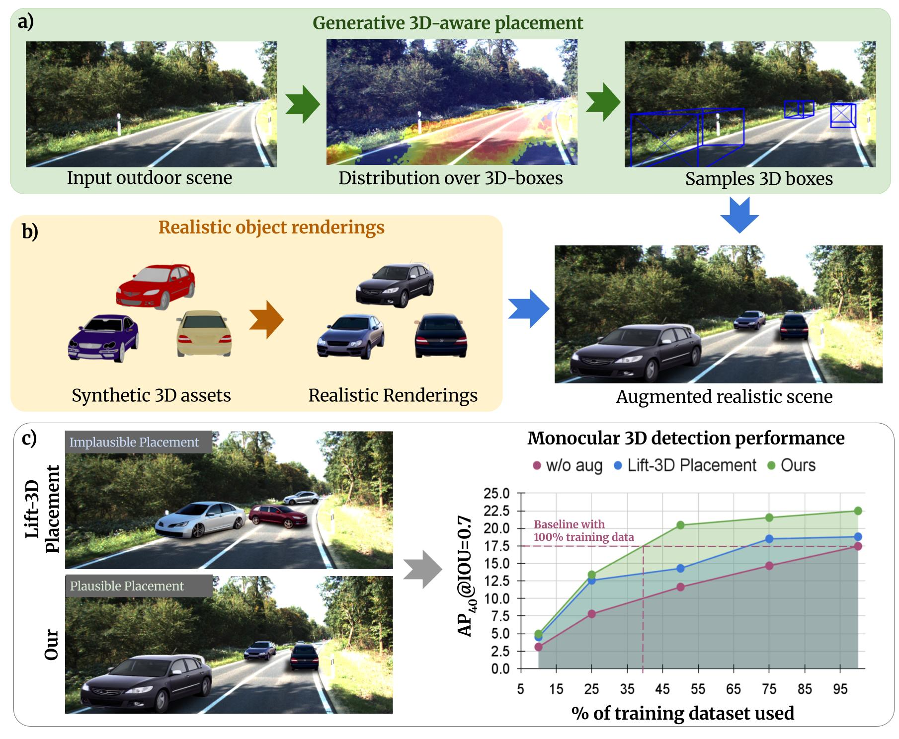

# MonoPlace3D

**MonoPlace3D: Learning 3D-Aware Object Placement for 3D Monocular Detection** (CVPR 2025) [[paper](https://arxiv.org/abs/2504.06801)]\
Rishubh Parihar, Srinjay Sarkar, Sarthak Vora, Jogendra Kundu, R. Venkatesh Babu.




## Setup

Please refer to [INSTALL.md](./Placement/INSTALL.md) for installation and to [DATA.md](./Placement/DATA.md) for data preparation.


## Train

Move to root and train the network with `$EXP_NAME`:

```sh
 cd Placement #MonoDTR_ROOT
 CUDA_VISIBLE_DEVICES=$GPUS python scripts/train.py --config=$CONFIG_PATH --experiment_name=$EXP_NAME
```

## Eval

To evaluate on the validation set using checkpoint `$CHECKPOINT_PATH`:

```sh
CUDA_VISIBLE_DEVICES=$GPU python3 scripts/eval.py --config=$CONFIG_PATH --gpu=0 --checkpoint_path=$CKPT_PATH --split_to_test=$SPLIT 
```

## Citation

If you find our work useful in your research, please consider citing:

```
@misc{rishubh2025monoplace3D,
      title={MonoPlace3D: Learning 3D-Aware Object Placement for 3D Monocular Detection},
      author={Rishubh Parihar,Srinjay Sarkar,Sarthak Vora,Jogendra Kundu,R. Venkatesh Babu},
      journal={Conference on Computer Vision and Pattern Recognition},      
      year={2025}, 
}
 ```

## License

This project is released under the MIT License.
